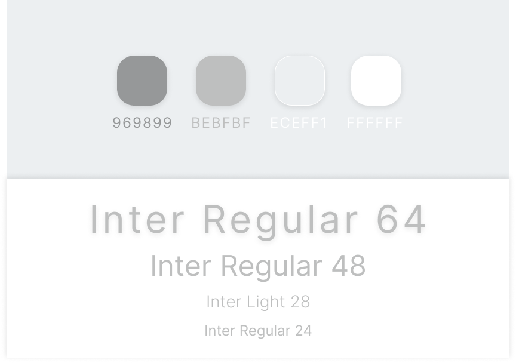

[App page](https://bencubin.github.io/unqwertier/ 'Unqwerty!')

## Unqwertier

Simple password generator

#### Parameters available for customisation:

- length (from 4 to 16)
- numbers
- letters
- capitals
- symbols

After being generated, password automaticaly copied to the clipboard.  
Logic is written on JavaScript.  
UX/UI designed by me.

#### Design kit:

#### Font:

[Google Fonts - Inter](https://fonts.google.com/specimen/Inter 'Google Fonts - Inter')

---

Простой генератор надежных паролей.
В зависимости от выставленных пользователем параметров, генерируется набор случайных символов.
Логика написана на JavaScript, дизайн разработан мной.
