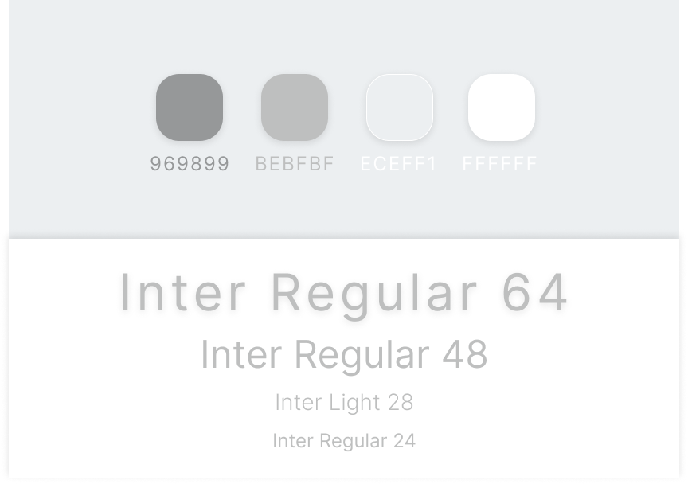

## Unqwertier

Simple password generator.

---

#### Parameters available for customisation:

- length (from 4 to 16)
- numbers
- letters
- capitals
- symbols

---

After being generated, password automaticaly copied to the clipboard.  
Logic is written on JavaScript.  
UX/UI designed by me.

---

#### Design kit:

---

#### Font:

[Google Fonts - Inter](https://fonts.google.com/specimen/Inter 'Google Fonts - Inter')

---

[UNQWERTY!](https://kvrdv.github.io/unqwertier/)
